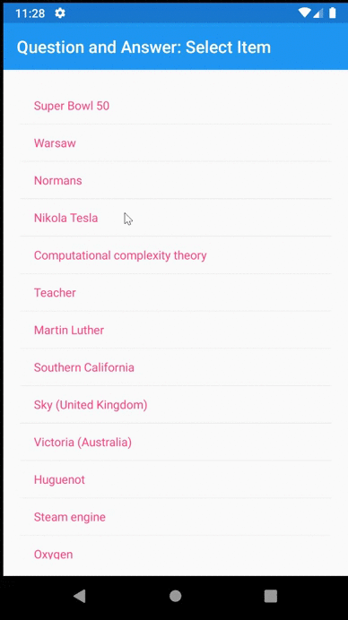

# BERT QA Demo
Demonstrates the application of the Tensorflow Lite BERT Q&A model in a Xamarin Forms / F# [Fabulous](https://fsprojects.github.io/Fabulous/) application.

## Model 
This particular BERT model is trained for question answering on a Wikipedia derived dataset. It is based on [this](https://github.com/tensorflow/examples/tree/master/lite/examples/bert_qa/android) tensorflow sample.

## Model Application
The sample application demonstrates how to prepare the text and the query for input to the model. Both the text and query have to be encoded together. Preprocessing is somewhat involved as it requires first performing basic tokenization, which itself is specific to the model. Then each token is further split into 'word pieces' according to the supplied vocabulary. The tokenization code is available in [QA.fs](BertQA.Android/QA.fs).

## Model Performance
Here the model is applied to the dataset that comes with the sample. The model performance (accuracy) is excellent on the supplied dataset with pre-formatted questions. It needs to be tested on other types of input to obtain a better understanding of the performance. BERT is designed to be adaptable for other text tasks with easy re-training and therefore is very versatile However, even as-is, BERT is an impressive accomplishment. Appreciate Google's generosity in sharing this with the world.

## Fabulous and F#
The sample also demonstrates how to easily build mobile applications in a functional and declarative style. The code is surprisingly small and clean. The application is divided into two projects: a) BertQA is the UI built with Fabulous and Xamarin Forms and b) BertQA.Android is the Android host application. Note that BertQA is platform independent and can be easily also hosted in an IOS or Windows application.

